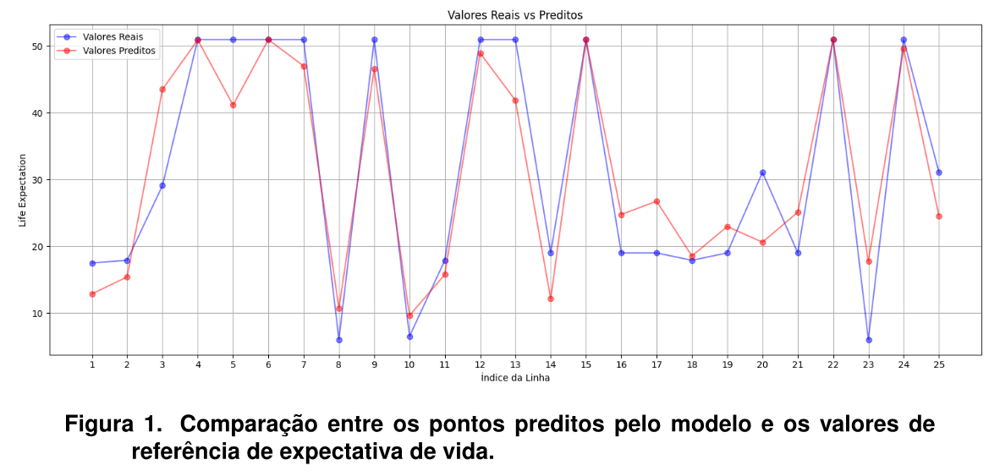
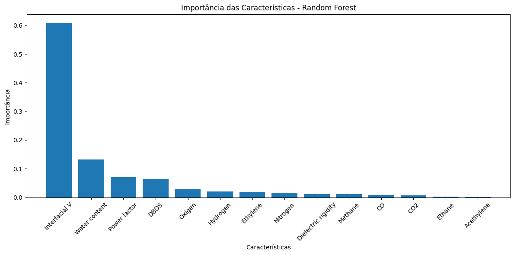

# Random Forest Experiment for Power Transformer Gas Analysis

## Overview
This study presents a Random Forest-based approach for analyzing dissolved gases in power transformers. Transformers contain insulating oil that decomposes under electrical and thermal stress, generating characteristic gases. Monitoring these gases enables predictive maintenance, allowing early fault detection and performance optimization before critical failures occur.

This work was developed for the Pattern Recognition course in the Master of Computer Science program at Universidade Estadual de Londrina (UEL).

## Tech-Stack  
- python language
- Random Forest Regressor

## Results : 
Com um hyperterminal envia-se o comando LER_ADC para leitura dos valores ou outro camando será inválido.

